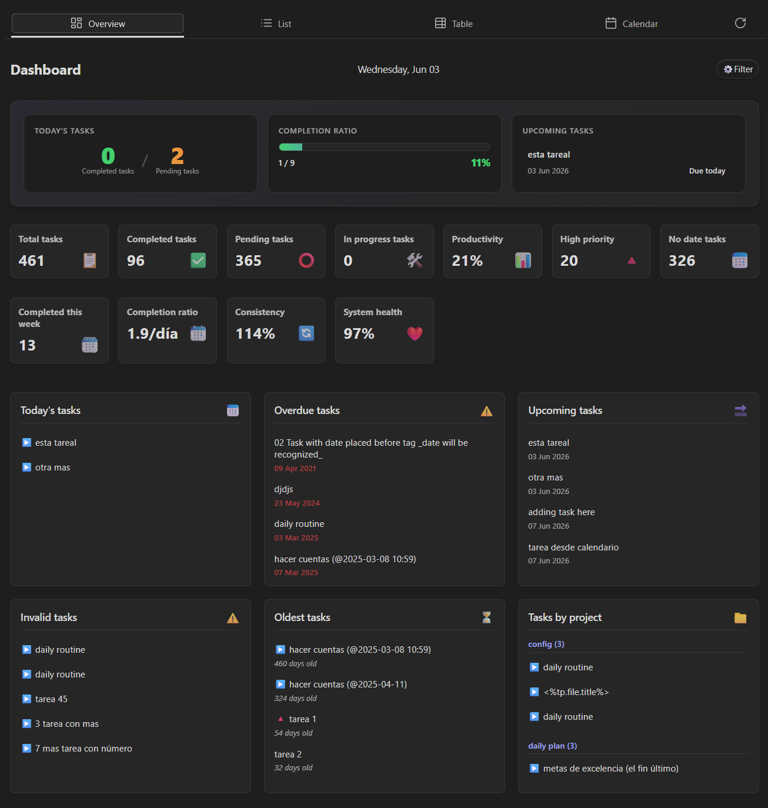
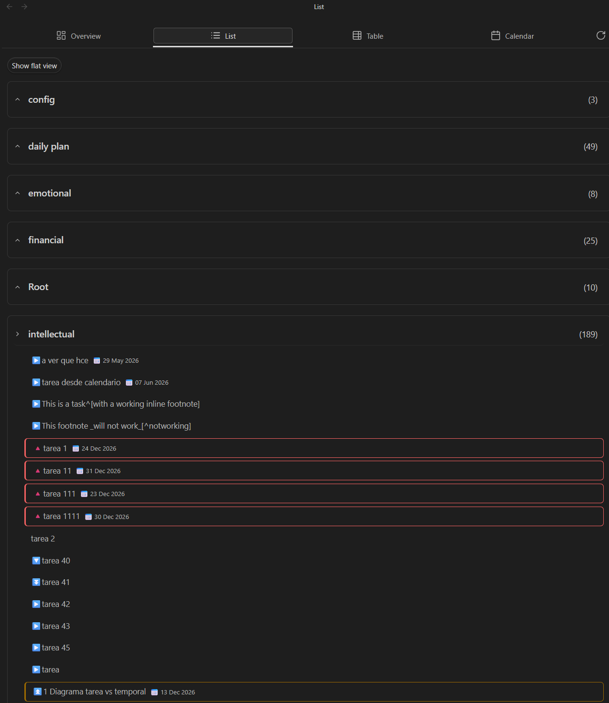
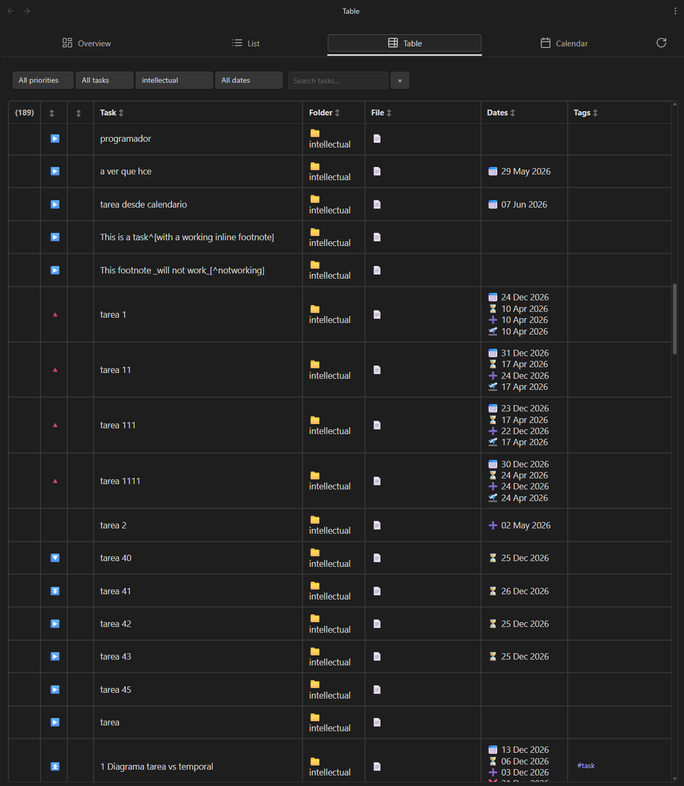
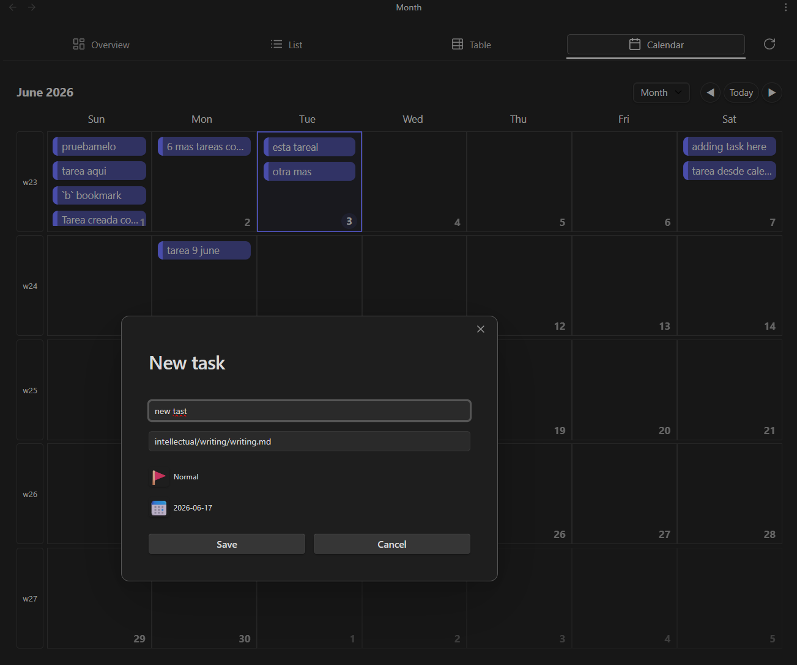
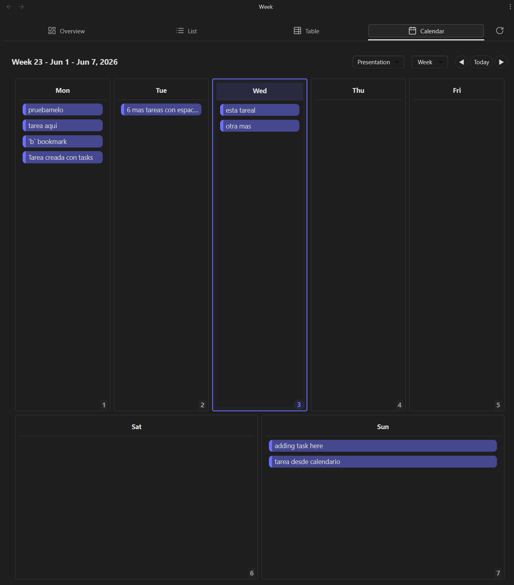
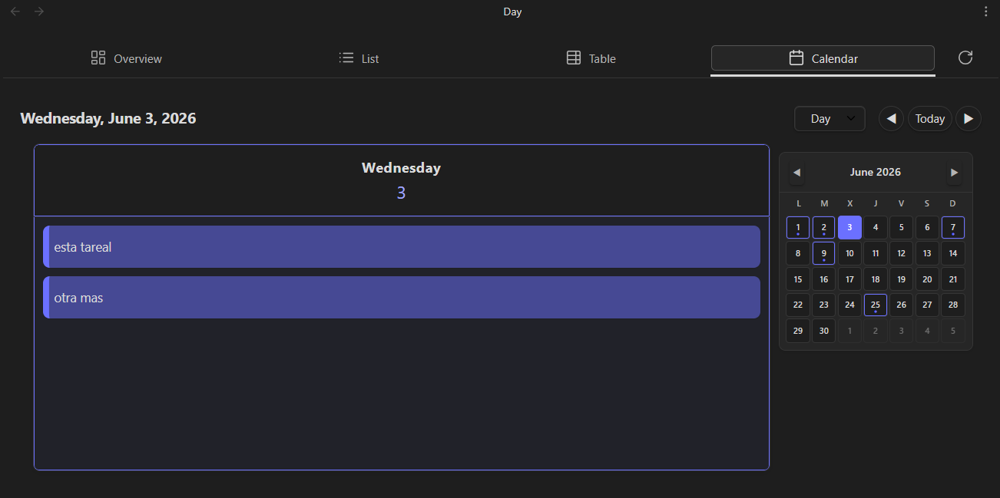

# Agenda Tasks 1.0.1

A comprehensive task management and calendar plugin for Obsidian (https://obsidian.md).

Agenda Tasks transforms your vault into a powerful productivity system by providing intuitive task management interfaces and calendar views. Seamlessly integrate with your existing Obsidian notes while organizing tasks across multiple views.

## Features

### General Features
- ✅ Parse and track tasks from your entire vault
- ✅ Compatible with [Obsidian Tasks](https://github.com/obsidian-tasks-group/obsidian-tasks) syntax and metadata
- ✅ Multiple view types to manage tasks according to your workflow
- ✅ Real-time task updates
- ✅ Customizable interface with themes support
- ✅ Keyboard shortcuts for common actions
- ✅ Localization support

### Overview View
- ✅ Dashboard-style task summary
- ✅ Statistics and progress tracking
- ✅ Quick access to upcoming deadlines
- ✅ Task distribution by project/folder
- ✅ Overdue task highlighting
- ✅ Customizable widgets

### List View
- ✅ Customizable task listing with multiple columns
- ✅ Advanced filtering by date, project, priority, and tags
- ✅ Group tasks by date, folder, status, or custom attributes
- ✅ Inline task editing
- ✅ Collapsible task groups
- ✅ Bulk actions for multiple tasks

### Table View
- ✅ Spreadsheet-style task management
- ✅ Customizable columns and layouts
- ✅ Sortable and resizable columns
- ✅ Quick entry and editing of task attributes
- ✅ CSV export capabilities
- ✅ Conditional formatting

### Calendar View
- ✅ Multiple calendar layouts (day, week, work week, and month)
- ✅ Task visualization on calendar grid
- ✅ Mini-calendar for quick date navigation
- ✅ Task indicators showing busy days
- ✅ Quick task creation at specific times
- ✅ Syncs with native Obsidian daily notes

## Screenshots

Overview view

List View

Table View

Month View

Week View

Day View

## Demo Videos

### Overview View Demo
See the [Overview screenshot](screenshots/Overview.png) for a preview of the dashboard.

### List View Demo
See the [List View screenshot](screenshots/ListView.png) for a preview of the list layout.

### Table View Demo
See the [Table View screenshot](screenshots/TableView.png) for a preview of the spreadsheet-style layout.

### Calendar View Demo
See the [Month View screenshot](screenshots/MonthView.png) and [Week View screenshot](screenshots/WeekView.png) for calendar previews.

## Installation

### From Obsidian Community Plugins
1. Open Obsidian Settings
2. Go to Community Plugins and disable Safe Mode
3. Click Browse and search for "Agenda"
4. Install the plugin and enable it

### Manual Installation
1. Download the latest release from the releases page
2. Extract the zip file to your vault's `.obsidian/plugins/` folder
3. Ensure you have the following files in `.obsidian/plugins/obsidian-agenda/`:
   - `main.js`
   - `styles.css`
   - `manifest.json`
4. Enable the plugin in Obsidian settings

## Usage

1. Create a new Agenda view by clicking the Agenda icon in the left sidebar
2. Choose your preferred view type (Overview, List, Table, or Calendar)
3. Tasks from your vault will automatically appear in the selected view
4. Use the toolbar options to filter, sort, and customize your view

For detailed usage instructions, please refer to the [Wiki](https://github.com/elias-shalom/obsidian-agenda/wiki).

## Task Format and Compatibility

Agenda Tasks works with tasks created using the standard Obsidian checkbox format `- [ ]` and is fully compatible with the popular [Obsidian Tasks plugin](https://github.com/obsidian-tasks-group/obsidian-tasks). It recognizes and properly handles:

- Due dates (📅)
- Scheduled dates (⏳)
- Start dates (🛫)
- Priority markers (⏫⏬)
- Recurring tasks (🔁)
- Custom statuses (planned for a future version)
- Task tags

All metadata created with Obsidian Tasks will be properly recognized and displayed in Agenda Tasks views.

## Configuration

Agenda Tasks offers numerous configuration options through the settings tab:
- Task parsing rules
- Default view settings
- Display preferences
- Integration with other plugins

## Scope this version 1.0.0

Version 1.0.0 of Agenda Tasks focuses on providing robust viewing and organization capabilities for your tasks while maintaining compatibility with existing Obsidian workflows:

Included in Version 1.0.0:

1. Multiple task visualization views (Overview, List, Table, Calendar)
2. Full compatibility with standard Obsidian task format (- [ ])
3. Integration with Obsidian Tasks plugin metadata (due dates, start dates, priorities, tags)
4. Advanced filtering, sorting, and grouping capabilities
5. Customizable display options and themes

Current Limitations:

1. Task creation and editing requires using Markdown files or the Obsidian Tasks plugin
2. Calendar view does not support time-of-day scheduling (hours) as the Tasks plugin doesn't recognize this format
3. View-only functionality for most task operations

## Scope this version 1.0.1

1. Enhanced compatibility with Tasks plugin dataview format
2. Recursive/repeating tasks support (🔁)
3. Support for mobile devices

Planned for Future Versions:

1. Native task creation and editing within Agenda views
2. Support for time-of-day task scheduling
3. Custom status implementation
4. Advanced calendar features with time blocks
5. More widgets on dashboard view

## Support and Feedback

If you encounter any issues or have suggestions for improvements, please file an issue on the [GitHub repository](https://github.com/elias-shalom/obsidian-agenda/issues).

## Funding

If you find this plugin useful, please consider supporting its development by starring the [GitHub repository](https://github.com/elias-shalom/obsidian-agenda) and spreading the word.

