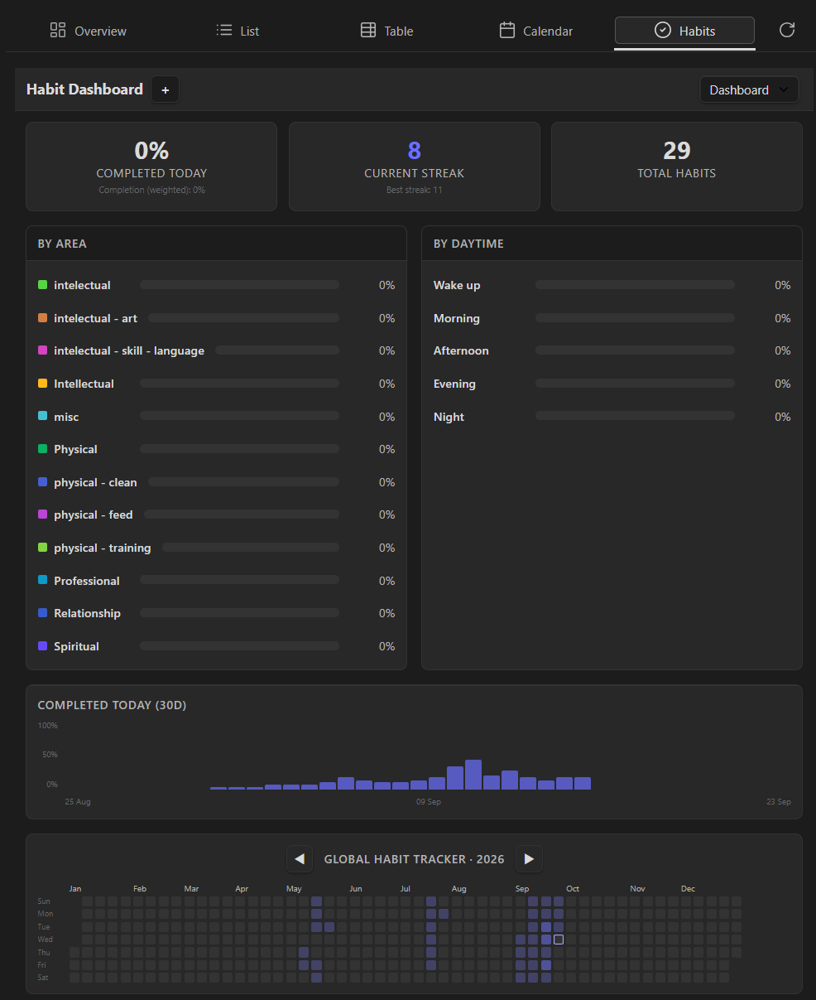
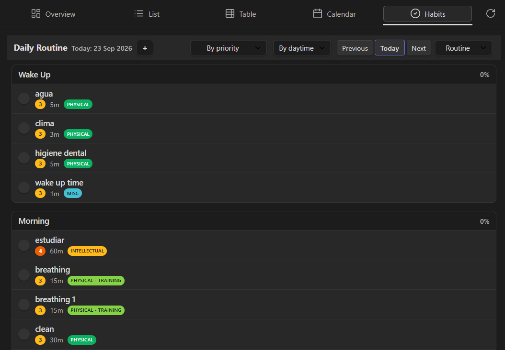
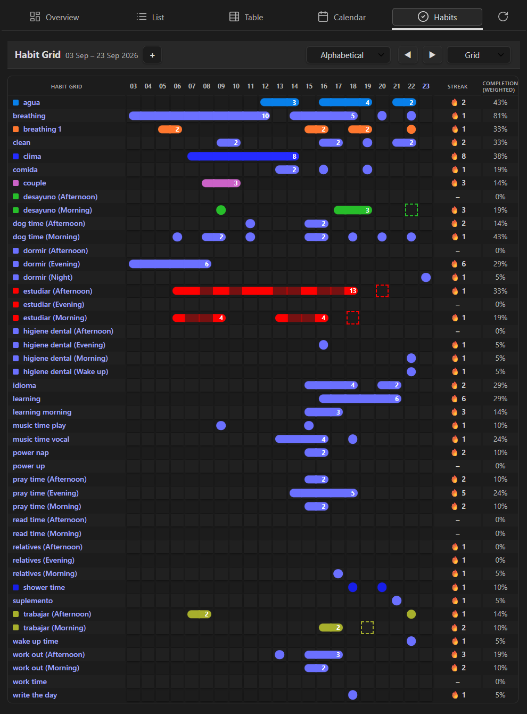
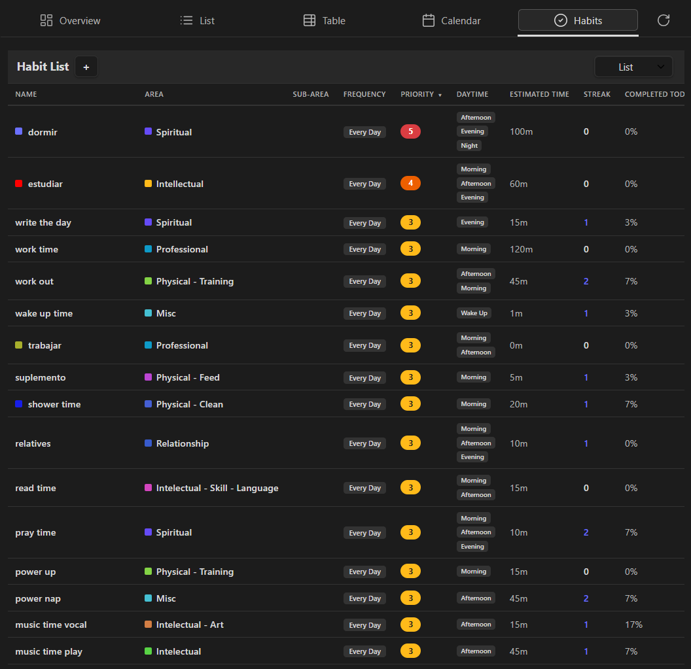
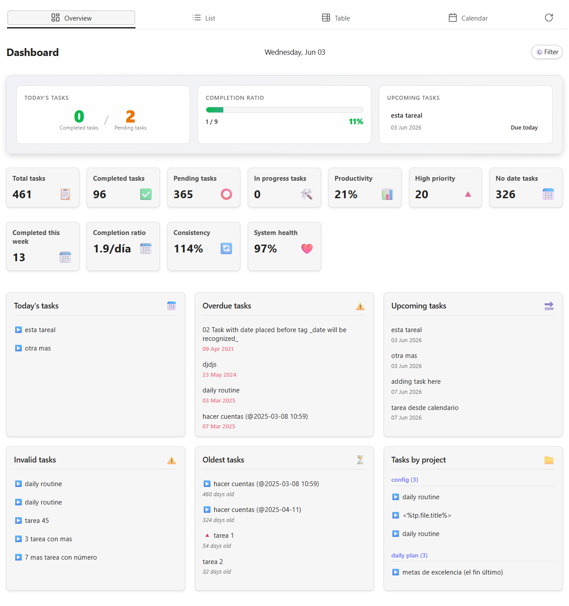
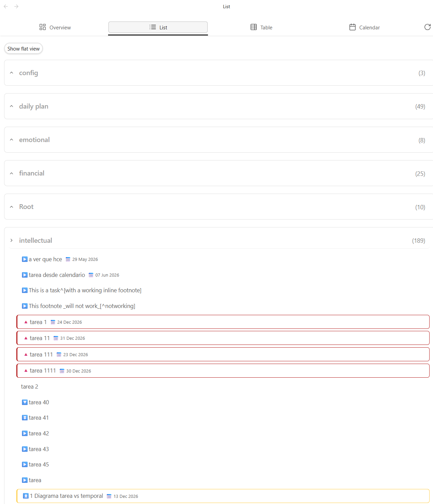
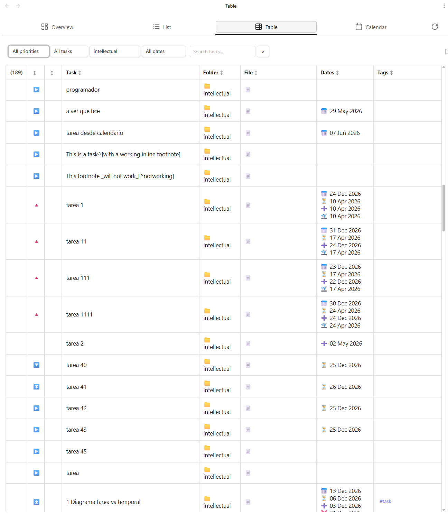
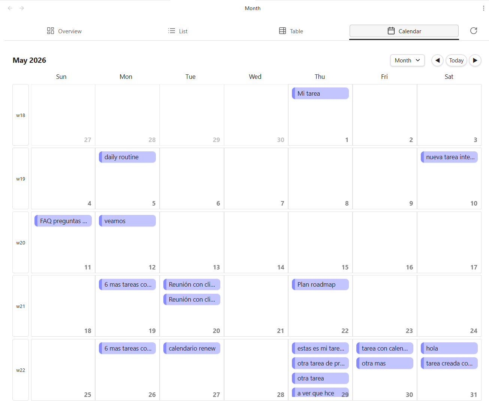
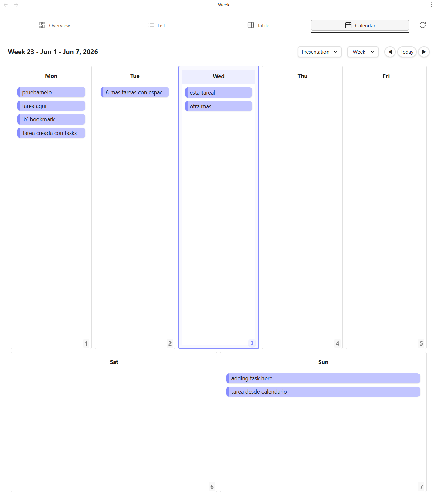
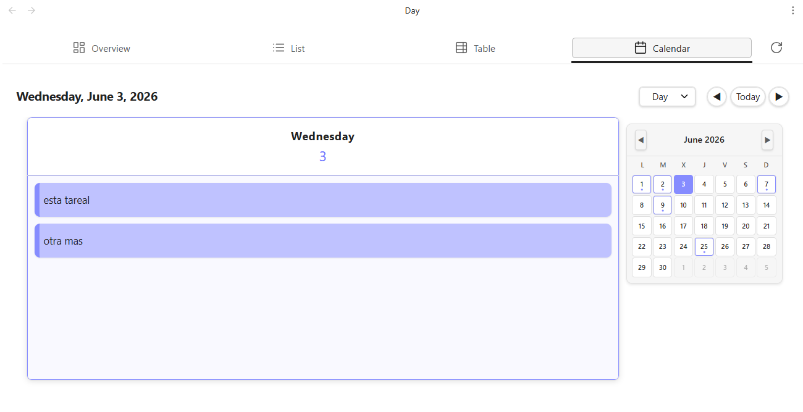

# 📅 Agenda Tasks

> A comprehensive task management and calendar plugin for Obsidian

[](https://github.com/elias-shalom/obsidian-agenda/releases)
[](LICENSE)
[](https://obsidian.md)

## Overview

Agenda Tasks transforms your Obsidian vault into a powerful productivity system by providing intuitive task management interfaces and multiple calendar views. Seamlessly integrate with your existing Obsidian notes while organizing tasks across multiple views for maximum efficiency.

**Key Benefits:**
- 🎯 Multiple view types tailored to different workflows
- 🔄 Real-time synchronization with your notes
- 🏗️ Compatible with Obsidian Tasks plugin
- 🌐 Support for 6+ languages
- ⚙️ Highly customizable interface

---

## 📖 Table of Contents

- [Features](#features)
- [Screenshots](#screenshots)
- [Installation](#installation)
- [Quick Start](#quick-start)
- [Task Format](#task-format-and-compatibility)
- [Configuration](#configuration)
- [Changelog](#changelog)
- [Planned Features](#planned-for-future-versions)
- [Support](#support-and-feedback)
- [Contributing](#contributing)

---

## ✨ Features

### 📊 Available Views

#### Overview View
- Dashboard-style task summary with key metrics
- Statistics and progress tracking
- Quick access to upcoming deadlines
- Task distribution by project/folder
- Overdue task highlighting
- Customizable widgets

#### List View
- Customizable task listing with multiple columns
- Advanced filtering by date, project, priority, and tags
- Group tasks by date, folder, status, or custom attributes
- Inline task editing
- Collapsible task groups
- Bulk actions for multiple tasks

#### Table View
- Spreadsheet-style task management
- Customizable columns and layouts
- Sortable and resizable columns
- Quick entry and editing of task attributes
- CSV export capabilities
- Conditional formatting

#### Calendar View
- Multiple calendar layouts (day, week, work week, month, and year)
- Task visualization on calendar grid
- Mini-calendar for quick date navigation
- Task indicators showing busy days
- Quick task creation at specific times
- Syncs with native Obsidian daily notes

#### Habit Tracker (new in 1.1.0)
- **Habit Grid** - GitHub-style day-by-day grid with a merged streak "pill", per-occurrence rows for multi-daytime habits, and a configurable sort order
- **Daily Routine** - Today's habits grouped by daytime or by area (toggle), with weighted progress bars and quick actions to open the note or edit the habit
- **Habit Dashboard** - Today's raw/weighted completion, current and best streaks, side-by-side breakdowns by area and daytime, a 30-day history chart, and a GitHub-style yearly heatmap you can navigate by year (this is now the default habit view)
- **Weekly view** - 7-day matrix sharing the same visual language as the Grid (pills, circles, sorting)
- **Habit Table/List** - Sortable catalog of all habits with area, related-file link, frequency, priority, daytime, time and streak columns
- **Habit Creator** - A modal to create and edit habits: a circular time dial, priority/max-gap sliders, an active/inactive switch, and an area combobox suggested from your vault's root folders (free-form, not a fixed list)

### 🔧 General Capabilities
- ✅ Parse and track tasks from your entire vault
- ✅ Compatible with [Obsidian Tasks](https://github.com/obsidian-tasks-group/obsidian-tasks) syntax
- ✅ Real-time task updates
- ✅ Built-in Habit Tracker module (Grid, Routine, Dashboard, Weekly and Table views, plus a habit creator/editor)
- ✅ Customizable interface with themes support
- ✅ Keyboard shortcuts for common actions
- ✅ 6+ language support (English, Spanish, German, Portuguese, French, Italian)
---

## 📸 Screenshots

| View | Screenshot |
|------|-----------|
| **Overview Dashboard** |  |
| **List View** |  |
| **Table View** |  |
| **Month Calendar** |  |
| **Week Calendar** |  |
| **Day View** |  |

---

| View | Screenshot |
|------|-----------|
| **Habit Dashboard** |  |
| **Daily Routine** |  |
| **Habit Grid** |  |
| **Habit List** |  |

---

| View | Screenshot |
|------|-----------|
| **Overview Dashboard** |  |
| **List View** |  |
| **Table View** |  |
| **Month Calendar** |  |
| **Week Calendar** |  |
| **Day View** |  |

---

## 📥 Installation

### From Obsidian Community Plugins (Recommended)
1. Open **Obsidian Settings**
2. Navigate to **Community Plugins** and disable **Safe Mode**
3. Click **Browse** and search for **"Agenda"**
4. Click **Install** and then **Enable**

### Manual Installation
1. Download the latest release from the [releases page](https://github.com/elias-shalom/obsidian-agenda/releases)
2. Extract the zip file to your vault's `.obsidian/plugins/obsidian-agenda/` folder
3. Verify the following files are present:
   - `main.js`
   - `styles.css`
   - `manifest.json`
4. Enable the plugin in **Obsidian Settings → Community Plugins**

**Requirements:**
- Obsidian v0.13.0 or higher
- No additional dependencies required

---

## 🚀 Quick Start

### Creating Your First Agenda View
1. Click the **Agenda icon** in the left sidebar ribbon
2. Select your preferred view type:
   - **Overview** - Dashboard with key metrics
   - **List** - Detailed task list
   - **Table** - Spreadsheet view
   - **Calendar** - Calendar visualization
3. Your tasks will automatically populate from your vault

### Common Actions
- **Filter tasks** - Use the filter panel to narrow down tasks
- **Create task** - Use Ctrl+P or the create button
- **Edit task** - Click any task to edit inline or in modal
- **Sort tasks** - Click column headers to sort (List and Table views)

For comprehensive guides, visit the [Wiki](https://github.com/elias-shalom/obsidian-agenda/wiki).

---

## 📝 Task Format and Compatibility

Agenda Tasks works seamlessly with tasks created using the standard Obsidian checkbox format (`- [ ]`) and is fully compatible with the popular [Obsidian Tasks plugin](https://github.com/obsidian-tasks-group/obsidian-tasks).

### Supported Metadata

The plugin recognizes and properly handles all standard Obsidian Tasks metadata:

| Metadata | Icon | Example |
|----------|------|---------|
| Due Date | 📅 | `- [ ] Task 📅 2024-12-31` |
| Scheduled Date | ⏳ | `- [ ] Task ⏳ 2024-06-15` |
| Start Date | 🛫 | `- [ ] Task 🛫 2024-06-01` |
| Priority | ⏫⏬ | `- [ ] Task ⏫` |
| Recurrence | 🔁 | `- [ ] Task 🔁 every day` |
| Tags | `#tag` | `- [ ] Task #project #urgent` |

### Example Task
```markdown
- [ ] Complete project documentation 📅 2024-12-31 ⏫ #project #documentation
- [ ] Review pull requests ⏳ 2024-06-15 #code-review
- [x] Submit final report 🛫 2024-06-01 ✅
```

---

## ⚙️ Configuration

### View Settings
- **Tab Visibility** - Choose which views to display in the header
- **Default View** - Set your preferred view on plugin load
- **Theme Integration** - Customize colors and appearance

### Filtering & Sorting
- **Date Filters** - Filter by today, overdue, upcoming, or custom ranges
- **Priority Filters** - Show tasks by priority level
- **Tag Filters** - Filter by task tags
- **Folder Filters** - Organize by file location

### Advanced Options
- **Keyboard Shortcuts** - Customize shortcuts for common actions
- **Widget Configuration** - Personalize dashboard widgets
- **Display Preferences** - Adjust how tasks are displayed

### Habit Tracker Settings
- **Habit Folder Path** - Vault folder scanned (recursively) for habit notes
- **Days to Show** - Number of columns/days rendered in the Grid and history charts
- **Show Streaks** - Toggle streak indicators and counts
- **Default Max Gap** - Default tolerance (in days) before a streak breaks
- **Tab Visibility** - Show/hide each habit view (Grid, Routine, Dashboard, Weekly, Table) independently

Access settings via: **Obsidian Settings → Community Plugins → Agenda Tasks**

---

## 📋 Changelog

### Version 1.1.2 🎯
- Habit **`subArea`** replaced by **`relatedFile`**: link a supporting note to a habit (wikilink-aware), with the same file picker/autocomplete UX as the task modal; openable from the Table (🔗 column) and Routine views
- Habit Editor: frequency dropdown and weekday checkboxes are now two-way synced (picking a preset checks the matching days; checking days updates the dropdown to the matching preset or "Custom"); blocks saving with zero days selected
- Habit Editor: Daytime and weekday checkboxes now lay out in a fixed 3-per-row grid
- Grid/Weekly views: unscheduled days sandwiched inside an active streak now render as a thin connecting line instead of breaking the pill; a habit completed on a day that's since been removed from its frequency now shows a distinct "conflict" marker (circle with red diagonal) instead of silently fading away
- Grid/Weekly views: fixed a brief flash of the wrong pill shape during the optimistic toggle-then-refresh window
- Table view now includes inactive habits with a read-only Active/Inactive column, and only responds to double-click (single click no longer opens anything)

### Version 1.1.1 🔧
- Settings tab now implements the Obsidian 1.13+ declarative settings API (`getSettingDefinitions()`), so plugin settings are findable via the global settings search on newer Obsidian versions; the legacy `display()` implementation is kept for older versions
- Distinct workspace tab icons per main view (Overview, List, Table, Calendar, Habits) instead of a shared icon
- Various type-safety and lint cleanups across the Habit Tracker module (no unnecessary type assertions, no unsafe `any` access)

### Version 1.1.0 🌱
- New **Habit Tracker** module with 5 dedicated views: Grid, Daily Routine, Dashboard, Weekly and Table
- **Habit Creator** modal to create/edit habits (circular time dial, priority/max-gap sliders, status switch, color picker)
- Habit **area** is a free-form field with vault-folder suggestions (no fixed category list)
- Configurable sort order (alphabetical, area, daytime, priority, streak, %) across Grid, Weekly and Routine
- Routine view can group habits by daytime or by area
- Dashboard now shows side-by-side area/daytime breakdowns, a 30-day history chart with axis legends, and a new GitHub-style yearly heatmap; it's the new default habit view
- Streaks rendered as merged "pill" runs on the Grid and Weekly views

### Version 1.0.6
- Fix calentar weekday

### Version 1.0.5 🎨
- Improved loading experience with skeleton loading (replaced spinner)
- Enhanced list view aesthetics and visual design
- Priority distinction and highlighting in list view
- New hero widget added to dashboard
- Various UI/UX improvements and polish

### Version 1.0.4 ✨
- Native task creation from calendar views (add task to calendar)
- Command palette integration (Ctrl+P shortcut for task creation)
- Task reload button in toolbar
- Mouse over highlight in list view
- Alphabetical sorting in list view
- Day line indicator in month view
- Navigate to day view from year view

### Version 1.0.3 🎨
- Configurable view header tabs
- Display today's date in Overview tab
- Week number display in header

### Version 1.0.2 🐛
- Calendar view year view
- Various bug fixes and stability improvements

### Version 1.0.1 🚀
- Enhanced compatibility with Tasks plugin dataview format
- Recursive/repeating tasks support (🔁)
- Mobile device support

### Version 1.0.0 🎉
**Included Features:**
- Multiple task visualization views (Overview, List, Table, Calendar)
- Full compatibility with standard Obsidian task format
- Integration with Obsidian Tasks plugin metadata
- Advanced filtering, sorting, and grouping capabilities
- Customizable display options and themes

**Known Limitations (at release):**
- Task creation and editing requires Markdown files or Obsidian Tasks plugin
- Calendar view does not support time-of-day scheduling
- View-only functionality for most task operations

---

## 🗓️ Planned for Future Versions

- ⬜ Advanced task creation/editing UI
- ⬜ Time-of-day task scheduling
- ⬜ Custom status implementation
- ⬜ Time blocks and scheduling
- ⬜ Advanced dashboard widgets
- ⬜ Integration with external calendar services

---

## 🤝 Contributing

We welcome contributions! Whether it's bug reports, feature suggestions, or code improvements:

1. **Report Issues** - [GitHub Issues](https://github.com/elias-shalom/obsidian-agenda/issues)
2. **Submit PRs** - Fork the repository and create a pull request
3. **Improve Translations** - Help translate the plugin to more languages

### Development Setup
```bash
# Clone the repository
git clone https://github.com/elias-shalom/obsidian-agenda.git
cd obsidian-agenda

# Install dependencies
npm install

# Start development
npm run dev

# Build for production
npm run build
```

---

## 💬 Support and Feedback

### Getting Help
- 📖 Check the [Wiki](https://github.com/elias-shalom/obsidian-agenda/wiki)
- 🐛 Report bugs on [GitHub Issues](https://github.com/elias-shalom/obsidian-agenda/issues)
- 💡 Suggest features via GitHub Discussions

### Feedback
Your feedback helps us improve! Please share:
- Feature requests
- Bug reports
- Usage suggestions
- Translation improvements

---

## ⭐ Support Us

If you find this plugin useful, please consider:
- ⭐ **Starring** the [GitHub repository](https://github.com/elias-shalom/obsidian-agenda)
- 📢 **Sharing** it with others
- 💬 **Reviewing** the plugin in Obsidian Community
- 🐛 **Reporting bugs** and suggesting improvements on GitHub
- 🌍 **Contributing translations** to support more languages

---

## 📄 License

This project is licensed under the [MIT License](LICENSE).

---

**Made with ❤️ for the Obsidian community**


